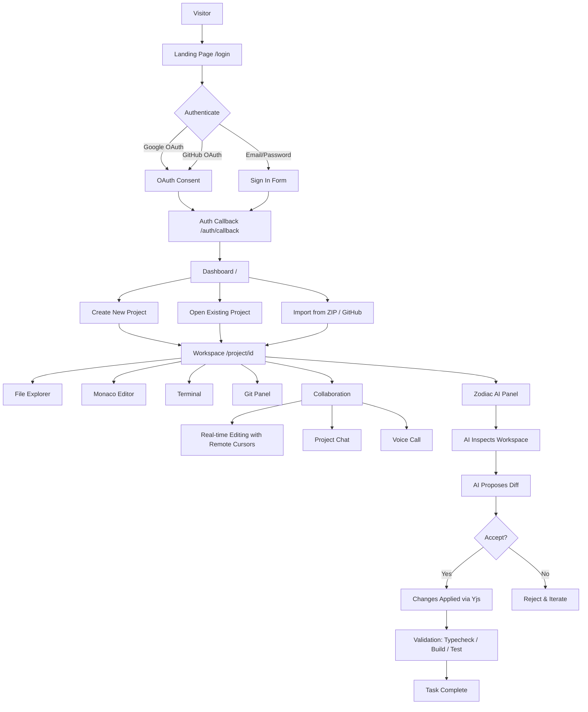
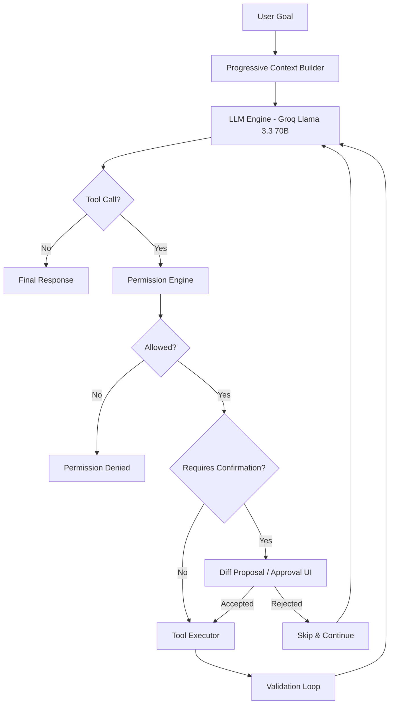
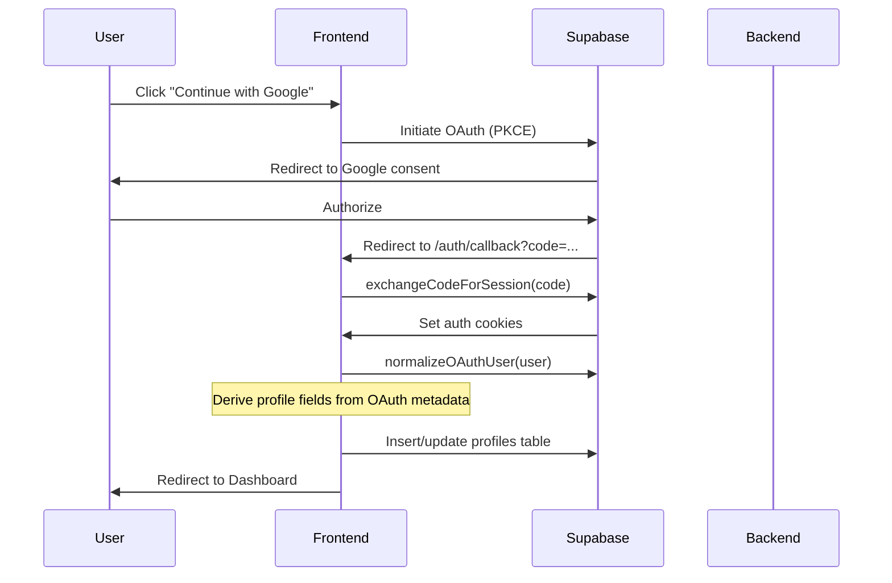
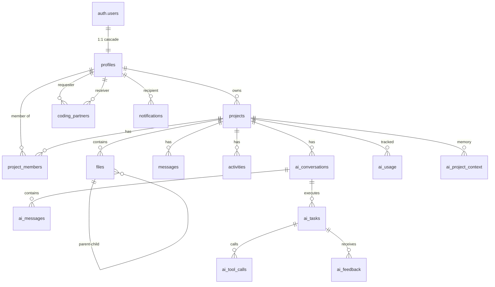
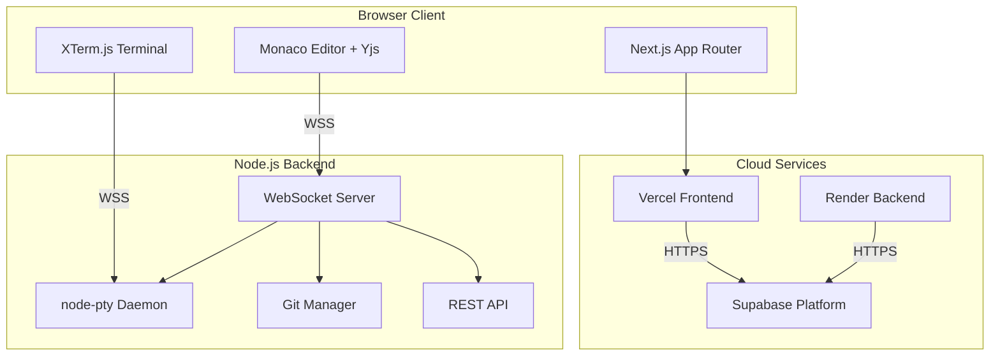
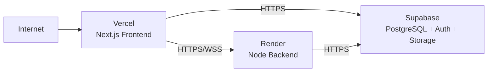

<p align="center">
  
</p>

<h1 align="center">RADIUX</h1>

<p align="center">
  <strong>Your Collaborative Development Environment, Reimagined.</strong>
</p>

<p align="center">
  A browser-based IDE with real-time collaboration, a native terminal, Git integration, and an autonomous AI coding agent — all in one workspace.
</p>

<p align="center">
  <a href="#quick-start">Quick Start</a> ·
  <a href="#features">Features</a> ·
  <a href="#architecture">Architecture</a> ·
  <a href="#zodiac-ai">Zodiac AI</a> ·
  <a href="#api-reference">API</a> ·
  <a href="#development">Development</a> ·
  <a href="#deployment">Deployment</a> ·
  <a href="#roadmap">Roadmap</a>
</p>

---

> **Project Status:** Public Beta / Pre-Production
> All core workflows are functional and deployed. The system is undergoing active development with a focus on hardening, sandboxing, and enterprise readiness.

---

## Table of Contents

- [Overview](#overview)
- [Why Radiux?](#why-radiux)
- [Product Philosophy](#product-philosophy)
- [Feature Matrix](#feature-matrix)
- [Product Showcase](#product-showcase)
- [Demo Video](#demo-video)
- [User Experience](#user-experience)
- [User Journey](#user-journey)
- [Interface Breakdown](#interface-breakdown)
- [Feature Deep Dive](#feature-deep-dive)
  - [Code Editor](#code-editor)
  - [File Explorer](#file-explorer)
  - [Terminal](#terminal)
  - [Git & Source Control](#git--source-control)
  - [Collaboration](#collaboration)
  - [Project Chat](#project-chat)
  - [Voice Communication](#voice-communication)
  - [Inline Comments & Code Review](#inline-comments--code-review)
  - [Notifications](#notifications)
  - [Dashboard](#dashboard)
  - [Profiles & Identity](#profiles--identity)
  - [Settings](#settings)
- [Zodiac AI Agent](#zodiac-ai-agent)
  - [Architecture](#zodiac-architecture)
  - [Agent Loop](#agent-loop)
  - [Tool Registry](#tool-registry)
  - [Permission Modes](#permission-modes)
  - [Validation Loop](#validation-loop)
- [Projects & Workspaces](#projects--workspaces)
- [Authentication](#authentication)
- [RBAC](#rbac)
- [Database](#database)
- [Architecture](#architecture)
- [Request & Data Flow](#request--data-flow)
- [API Reference](#api-reference)
- [WebSocket Architecture](#websocket-architecture)
- [Security](#security)
- [Performance](#performance)
- [Project Structure](#project-structure)
- [Tech Stack](#tech-stack)
- [Environment Variables](#environment-variables)
- [Quick Start](#quick-start)
- [Available Scripts](#available-scripts)
- [Building](#building)
- [Testing](#testing)
- [Deployment](#deployment)
- [Troubleshooting](#troubleshooting)
- [Common Failure Modes](#common-failure-modes)
- [Current Status](#current-status)
- [Limitations](#limitations)
- [Roadmap](#roadmap)
- [Contributing](#contributing)
- [License](#license)
- [Acknowledgements](#acknowledgements)
- [FAQ](#faq)
- [Glossary](#glossary)

---

## Overview

**Radiux** is a browser-based collaborative integrated development environment (IDE) that combines a VS Code-style code editor, a real OS-level terminal, Git version control, real-time multi-cursor collaboration, and an autonomous AI coding agent into a single, unified workspace.

### One-Sentence Explanation

Radiux is a cloud and local developer workspace platform that runs a complete development experience — editing, terminal, Git, collaboration, and AI assistance — directly inside web browsers.

### Detailed Explanation

Radiux eliminates the friction of local environment configuration, screen-sharing collaboration, and disconnected AI tooling by providing:

- **A real code editor** — Monaco (the editor that powers VS Code) with syntax highlighting for 35+ languages, 8 curated themes, multi-tab editing, breadcrumbs, diagnostics, and minimap
- **A real terminal** — OS-level pseudo-terminal sessions via `node-pty`, supporting PowerShell, CMD, Git Bash, WSL, Bash, and Zsh with multi-session tabs
- **Real-time collaboration** — Yjs CRDT-based shared editing with live remote cursors, selections, and awareness indicators
- **Full Git workflow** — Stage, commit, branch, merge, diff, push, and pull through a native `git` CLI integration
- **An autonomous AI agent** — "Zodiac" inspects your codebase, proposes surgical edits, runs terminal commands, validates changes through typecheck/build/test loops, and iterates until completion

### Who Radiux Is For

- **Development teams** who want real-time collaborative coding without screen-sharing
- **Developers** who want a zero-setup cloud workspace accessible from any machine
- **Educators and students** who need instant, shareable coding environments
- **Open-source contributors** who want to collaborate on code in real time

---

## Why Radiux?

### The Problem

Modern development workflows suffer from several persistent friction points:

| Problem | Impact |
| :--- | :--- |
| **Fragmented workflows** | Developers switch between editor, terminal, Git client, chat tools, and AI assistants — often across multiple applications and windows |
| **Local-only development** | "Works on my machine" — environment inconsistencies, dependency conflicts, and setup overhead slow down onboarding and collaboration |
| **Collaboration friction** | Screen sharing is laggy and read-only; traditional version control creates merge conflicts and serializes work |
| **Disconnected AI tooling** | AI chatbots generate code snippets that must be manually copied into files, tested, and iterated — breaking flow and context |
| **Terminal/editor separation** | Running commands requires context-switching to a separate terminal application |
| **Git workflow friction** | Staging, committing, branching, and reviewing requires leaving the editor or learning complex CLI commands |

### How Radiux Addresses These

- **Unified workspace** — Editor, terminal, Git, chat, and AI coexist in a single browser tab with shared context
- **Zero-setup cloud workspaces** — Create a project and start coding immediately; the terminal and filesystem are ready
- **Real-time collaboration** — Multiple developers edit the same files simultaneously with zero merge conflicts (Yjs CRDT)
- **AI-native workflow** — Zodiac operates directly on your codebase, proposes diffs you can review, and validates its own changes
- **Integrated terminal** — A real shell runs alongside your editor, with automatic port detection for previewing running applications
- **Visual Git** — Stage, commit, branch, and review diffs without leaving the IDE

---

## Product Philosophy

Radiux is built on these design principles:

- **IDE-first** — The code editor is the centerpiece; everything else supports the editing experience
- **Collaboration-first** — Real-time multi-user editing is not an add-on; it's the foundation
- **AI-native** — Zodiac is not a chat bubble bolted onto the side; it's an integrated agent that operates on your workspace with full context
- **Browser-based** — No local installation required; the entire experience runs in a browser tab
- **Developer-focused** — Every feature is designed for professional developers who need power and precision
- **Permission-aware** — RBAC governs every action, from file edits to AI tool execution
- **Real-time** — All state changes propagate instantly to all connected clients
- **Transparent automation** — AI actions are visible, reviewable, and revocable; nothing happens silently

---

## Feature Matrix

| Feature | Status | Description |
| :--- | :---: | :--- |
| **Monaco Editor** | ✅ Implemented | Multi-tab editing, 8 themes, 35+ language support, minimap, breadcrumbs, diagnostics |
| **Real-time Collaboration** | ✅ Implemented | Yjs CRDT shared editing with live remote cursors and selections |
| **Terminal** | ✅ Implemented | OS-level PTY via node-pty, multi-session, shell auto-detection |
| **Shell Detection** | ✅ Implemented | PowerShell 7, Windows PowerShell, CMD, Git Bash, WSL, Bash, Zsh |
| **Git Integration** | ✅ Implemented | Stage, commit, branch, merge, diff, push, pull via native git CLI |
| **GitHub Integration** | ✅ Implemented | Import from GitHub repos, push/pull via personal access tokens |
| **Authentication** | ✅ Implemented | Email/Password, Google OAuth, GitHub OAuth (PKCE) |
| **User Profiles** | ✅ Implemented | Public profiles, bio, skills, contribution graph, pinned projects |
| **Project Chat** | ✅ Implemented | Real-time messaging with media uploads and reactions |
| **WebRTC Voice** | ✅ Implemented | Peer-to-peer voice with mute controls (requires TURN for strict NATs) |
| **Notifications** | ✅ Implemented | Bell indicator, slide-in drawer, WebSocket + polling delivery |
| **Inline Comments** | ✅ Implemented | Line-level code review comments synced over WebSocket |
| **Code Review / PRs** | ✅ Implemented | Review request workflow with accept/decline actions |
| **Zodiac AI Agent** | ✅ Implemented | 29 tools, 3 permission modes, SSE streaming, validation loop |
| **AI Diff Proposals** | ✅ Implemented | Structured hunks with accept/reject in Monaco diff viewer |
| **Admin Console** | ✅ Implemented | User management, AI analytics, system health, audit logs |
| **Analytics** | ✅ Implemented | Event tracking, performance monitoring, AI usage metrics |
| **Dev Server Preview** | ✅ Implemented | Automatic port detection with reverse proxy preview |
| **File Explorer** | ✅ Implemented | Tree view, context menu, file icons, drag-and-drop |
| **Command Palette** | ✅ Implemented | Ctrl+Shift+P quick command execution |
| **Quick Open** | ✅ Implemented | Ctrl+P file search and open |
| **Global Search** | ✅ Implemented | Cross-project file content search |
| **Keyboard Shortcuts** | ✅ Implemented | Full VS Code shortcut parity with customization |
| **Settings** | ✅ Implemented | Editor preferences, themes, keybindings, sound toggle |
| **Public Project Showcase** | ✅ Implemented | Read-only public project pages with README rendering |
| **Dashboard** | ✅ Implemented | Project listing, quick starters, ZIP/GitHub import |
| **Extensions Panel** | 🔶 Partial | Visual marketplace showcase; extensions do not execute arbitrary code |
| **Container Sandbox** | ❌ Not Implemented | Terminal runs on host OS; no Docker/microVM isolation |
| **Automated Tests** | 🔶 Partial | Manual verification scripts only; no unit/integration test suite |

---

## Product Showcase

<!-- MEDIA PLACEHOLDER: docs/media/screenshots/overview.png
     Recommended capture: Full Radiux IDE workspace showing file explorer,
     Monaco editor with code, terminal panel, and AI agent panel. -->

<p align="center">
  <em>Product screenshot: Radiux workspace with file explorer, Monaco editor, terminal, and Zodiac AI panel</em>
</p>

> **Screenshot:** `docs/media/screenshots/overview.png`
>
> Recommended capture: Full Radiux IDE workspace showing the file explorer (left), Monaco editor with syntax-highlighted code (center), terminal panel (bottom), and Zodiac AI agent panel (right).

---

## Demo Video

<!-- VIDEO PLACEHOLDER: docs/media/videos/demo.mp4
     Recommended demo flow:
     00:00 — Open Radiux and sign in
     00:15 — Create a new project from dashboard
     00:30 — Explore the workspace: file explorer, tabs, themes
     00:50 — Edit code in Monaco with syntax highlighting
     01:10 — Open terminal and run a command
     01:30 — Start a dev server and preview in the browser
     01:50 — Invite a collaborator and edit together in real time
     02:15 — Collaborative editing with live cursors
     02:40 — Stage, commit, and create a branch in Git
     03:00 — Ask Zodiac to implement a feature
     03:40 — Zodiac inspects files, proposes a diff, and validates
     04:00 — Review and accept the AI-proposed changes -->

<p align="center">
  <em>Demo video: End-to-end Radiux workflow from project creation to AI-assisted development</em>
</p>

---

## User Experience

### First Visit

1. **Landing / Login** — New users arrive at `/login` with options for Email/Password, Google OAuth, or GitHub OAuth
2. **Authentication** — After OAuth redirect or email sign-in, the user is redirected to the Dashboard
3. **Dashboard** — The user sees their project list (empty for new users) with quick-create templates and import options

### Workspace Experience

Once inside a project workspace (`/project/[id]`), the user encounters:

- **Activity Bar** (far left, 48px) — Switch between Explorer, Source Control, Activity Feed, Extensions, and Collaborators
- **Sidebar** (260px, collapsible) — Context-sensitive panel for the active activity
- **Editor Area** — Monaco editor with tab strip and breadcrumbs
- **Bottom Dock** — Terminal, Output, Problems, Preview, Voice, and Chat tabs
- **Top Bar** — Project name, branch selector, Run button, Share/Invite, collaborator presence, notifications, user menu

### Loading States

- Workspace initialization loads project files from Supabase and syncs to local disk
- Yjs WebSocket connection establishes real-time sync
- Terminal WebSocket connects to the backend PTY daemon
- All panels show skeleton loaders during initial data fetch

### Empty States

- New projects show a "Create your first file" prompt in the file explorer
- Empty chat shows "No messages yet — start the conversation"
- Empty Git panel shows "No changes" or "Initialize repository" action

### Permission States

- **Visitor** role: Monaco editor is set to `readOnly`; terminal tab is hidden; Git write actions are blocked with 403 responses
- **Editor** role: Full editing capabilities; cannot manage members or delete the project
- **Owner** role: Full control including member management and project deletion

---

## User Journey



---

## Interface Breakdown

### Global Navigation

| Area | Description |
| :--- | :--- |
| **Activity Bar** | 48px vertical strip with icons for Explorer, Source Control, Feed, Extensions, Collaborators |
| **Top Bar** | Project name, branch selector, Run button, Share/Invite, presence avatars, notifications bell, user menu |
| **Status Bar** | Bottom strip with branch, errors/warnings count, notification count, Zodiac status |

### Workspace Layout

```
+------------------------------------------------------------------------------+
| Top Bar: Project Name | Branch | Run | Share | Presence | Bell | User Menu |
+----+-------------------------------------------------------------------+-----+
| A  | Sidebar  | Editor Tab Strip                                         | N  |
| c  | (260px)  +----------------------------------------------------------+ o  |
| t  |          | Breadcrumbs: src / components / App.tsx                   | t  |
| i  |  File    +----------------------------------------------------------+ i  |
| v  |  Explorer|                                                          | f  |
| i  |          |              Monaco Editor                                | y  |
| t  |  [src]   |              (with remote cursors)                        |    |
| y  |   [App]  |                                                          |    |
|    |   [ind]  |                                                          |    |
| B  |  [publ]  +----------------------------------------------------------+    |
| a  |          | Bottom Dock: Terminal | Output | Problems | Preview | ... |    |
| r  |          | $ npm run dev                                            |    |
|    |          | > Server running on port 3000                            |    |
+----+----------+----------------------------------------------------------+----+
| Status Bar: main | 0 errors | 0 warnings | 3 notifications | Zodiac Ready   |
+------------------------------------------------------------------------------+
```

### Editor

- **Engine:** Monaco Editor (the core of VS Code)
- **Multi-tab:** Open multiple files simultaneously with dirty indicators
- **Syntax highlighting:** 35+ file extension mappings
- **Themes:** 8 curated themes (Dark, Light, Midnight, Dracula, Monokai, Nord, Solarized, High Contrast)
- **Remote cursors:** Colored cursors with user name tags for each collaborator
- **Diagnostics:** Inline error/warning markers with Problems panel summary
- **Breadcrumbs:** Path navigation bar above the editor

### Terminal

- **Engine:** XTerm.js 6.0 with FitAddon
- **Multi-session:** Spawn multiple terminal tabs; rename, restart, or kill sessions
- **Shell support:** Auto-detects available shells on the host OS
- **Port detection:** Scans output for `localhost:XXXX` patterns and auto-highlights the Preview tab
- **Scrollback:** Output buffered in memory to preserve history across tab switches

### Collaboration

- **Presence avatars:** Active collaborators shown in the top bar with online status
- **Remote cursors:** See where other users are editing in real time
- **Follow mode:** Click a collaborator to jump to their active file and follow their cursor

### Zodiac AI

- **AI Panel:** Right-side panel with conversation history, streaming responses, and tool activity
- **Inline AI:** Ctrl+K opens an inline prompt within the editor for quick transformations
- **Diff viewer:** Side-by-side Monaco diff for reviewing AI-proposed changes
- **Permission selector:** Toggle between Read-Only, Assisted, and Autonomous modes

---

## Feature Deep Dive

### Code Editor

The editor is built on **Monaco Editor** — the same engine that powers Visual Studio Code. It provides:

- **Language detection:** Automatic mapping of 35+ file extensions to Monaco language IDs
- **Autosave:** Debounced (400ms) persistence to both Supabase and local workspace disk
- **Yjs binding:** Real-time collaborative editing via `y-monaco` with awareness protocol
- **Custom themes:** 8 hand-crafted themes with distinct visual identities
- **Editor settings:** Font size (10–28px), font family, tab size (2/4/8), word wrap, minimap toggle, line numbers

```typescript
// Language detection example (src/lib/types.ts)
export function detectLanguage(fileName: string): LanguageType {
  const ext = fileName.split('.').pop()?.toLowerCase();
  switch (ext) {
    case 'js': case 'mjs': case 'cjs': case 'jsx':
      return 'javascript';
    case 'ts': case 'tsx':
      return 'typescript';
    // ... 35+ extensions
    default:
      return 'plaintext';
  }
}
```

<!-- SCREENSHOT PLACEHOLDER: docs/media/screenshots/editor.png -->

### File Explorer

- **Tree view:** Hierarchical folder/file display with expand/collapse
- **Context menu:** Right-click for new file, new folder, rename, delete, duplicate
- **File icons:** Extension-aware icons via `FileIcon.tsx`
- **Drag-and-drop:** Move files and folders within the tree
- **Media detection:** Images, videos, and audio files are detected and can be previewed in a media viewer

### Terminal

The terminal subsystem is one of Radiux's most distinctive features — it provides a **real OS-level shell** inside the browser.

**Architecture:**

```
Browser (XTerm.js)
       |
       | WebSocket (/terminal?projectId=...&sessionId=...)
       v
Node.js Backend (node-pty)
       |
       | spawn(shell, args)
       v
Host OS Shell (PowerShell / CMD / Git Bash / WSL / Bash / Zsh)
```

**Key behaviors:**

- **Shell auto-detection:** `detectProfiles()` checks for available shells at startup
- **Environment sanitization:** All sensitive env vars (SUPABASE, GROQ, KEYS, TOKENS, etc.) are stripped before spawning
- **Multi-session:** Each terminal tab is an independent PTY process
- **Port detection:** Output is scanned via regex for `localhost:XXXX` patterns; detected ports trigger preview notifications
- **Process retention:** PTY processes survive brief disconnects (user refresh) before being reaped

<!-- SCREENSHOT PLACEHOLDER: docs/media/screenshots/terminal.png -->

### Git & Source Control

Git operations are handled by `server/git-manager.mjs` using native `git` CLI child processes.

| Operation | Status | Details |
| :--- | :---: | :--- |
| `git init` | ✅ | Initializes repo with safe author defaults (`Radiux Developer`) |
| `git status` | ✅ | Staged, unstaged, untracked files |
| `git add` / `git reset` | ✅ | Stage/unstage individual or all files |
| `git checkout --` | ✅ | Discard working tree changes |
| `git commit` | ✅ | Commit with custom author info |
| `git branch` | ✅ | List, create, delete, switch branches |
| `git merge` | ✅ | Merge branches |
| `git log` | ✅ | Commit history |
| `git diff` | ✅ | Side-by-side Monaco diff inspection |
| `git remote` | ✅ | Configure GitHub or other remotes |
| `git push` / `git pull` | ✅ | Authenticated via GitHub Personal Access Tokens |

The Git panel (`GitPanel.tsx`) provides a VS Code-style source control interface with one-click stage/unstage, commit message input, and branch switching.

### Collaboration

**Technology stack:** Yjs CRDT + y-websocket + y-monaco

**How it works:**

1. Each open file has a Yjs document bound to Monaco via `y-monaco`
2. Documents sync through the backend WebSocket server using the y-websocket protocol
3. Awareness protocol broadcasts cursor positions, selections, and user info
4. Remote cursors are rendered as colored overlays with user name tags

**Room naming:** `project-${projectId}-file-${file.id}`

**Conflict resolution:** Yjs uses Conflict-free Replicated Data Types (CRDTs), so concurrent edits to the same document never produce merge conflicts — the data structure guarantees consistency.

<!-- SCREENSHOT PLACEHOLDER: docs/media/screenshots/collaboration.png -->

### Project Chat

- **Real-time messaging:** Messages broadcast via WebSocket (`/comm` connection)
- **Media uploads:** Images, audio, video, and files uploaded to Supabase Storage (`chat-media` bucket, 50MB max)
- **Reactions:** Emoji reactions on messages
- **Markdown:** Code snippet formatting support

### Voice Communication

- **Technology:** Peer-to-peer WebRTC mesh network
- **Signaling:** Carried over the `/comm` WebSocket connection
- **STUN:** Google public STUN servers (`stun.l.google.com:19302`)
- **Audio constraints:** Echo cancellation, noise suppression, auto gain control
- **Limitation:** Requires a TURN server (e.g., Coturn) for symmetric NAT traversal

### Inline Comments & Code Review

- **Inline comments:** Line-level code review comments pinned in Monaco's glyph margin
- **Real-time sync:** Comments broadcast via WebSocket to all project members
- **Review requests:** PR-style review request workflow with accept/decline actions
- **Persistence:** Comments stored in local JSON store (`.workspaces/data/`) with cross-window sync

### Notifications

- **Delivery:** Real-time WebSocket push + 10-second polling fallback
- **UI:** Bell icon with unread badge in top bar; slide-in notification drawer
- **Types:** Partner requests, project invites, mentions, member joined, system
- **Actions:** Accept, Decline, Dismiss for actionable notifications
- **Deduplication:** Client-side `shownNotifIdsRef` + server-side idempotency keys

### Dashboard

- **Project listing:** All projects where the user is owner or member, with role badges
- **Quick creation:** Template buttons (Blank, Node.js, Python, HTML5/CSS, React)
- **Import:** From GitHub public URL or ZIP workspace archive
- **Developer discovery:** Button to browse peer developers

### Profiles & Identity

- **Public profiles:** `/profile/[username]` with bio, skills, technologies, custom Markdown README
- **Privacy controls:** Per-field privacy toggles (location, education, links, skills, activity, README, partners, email)
- **Contribution graph:** 52-week GitHub-style activity heatmap computed from the `activities` table
- **Pinned projects:** Up to 4 featured projects on the profile
- **Coding partners:** Send/accept/decline coding partner requests

### Settings

- **Editor:** Font size, font family, tab size, word wrap, minimap, line numbers
- **Theme:** Live preview across 8 themes
- **Sound:** Toggle for Web Audio API procedural sound effects
- **Keybindings:** Customizable shortcuts with conflict detection
- **Privacy:** Per-field profile visibility controls

---

## Zodiac AI Agent

**Zodiac** is Radiux's native AI coding agent — not a chatbot, but an autonomous, multi-step agent that operates directly on your workspace.

### Zodiac Architecture



### Agent Loop

The Zodiac agent runs an autonomous, multi-turn tool execution loop:

```
User Goal
   |
Progressive Context Builder (active file, selection, tree, diagnostics)
   |
LLM Engine (Groq Llama 3.3 70B, temperature 0.1)
   |
Tool Call Decision
   |
Permission Check (READ_ONLY / ASSISTED / AUTONOMOUS)
   |
Confirmation Check (if required)
   |
Tool Execution (filesystem / Git / terminal / diagnostics)
   |
Result -> Context Update
   |
Next Action (loop until completion or maxSteps)
   |
Validation (typecheck / build / test)
   |
Completion
```

**Key implementation details:**

- **Context compaction:** Older tool outputs (>500 chars, >1 step old) are truncated to keep prompts under ~2,000 tokens
- **Parallel execution:** Independent read-only tool calls are parallelized via `Promise.all`
- **SSE streaming:** All events stream to the client via Server-Sent Events for real-time UI updates
- **Task tracking:** Full task state (status, files inspected, files modified, commands run, validation results) is tracked and persisted to the database

### Tool Registry

Zodiac has access to 29 tools organized into categories:

#### File Inspection Tools

| Tool | Purpose | Permission | Side Effects |
| :--- | :--- | :--- | :--- |
| `list_files` | List files/directories with optional recursion | READ_ONLY | None |
| `read_file` | Read file contents with optional line ranges | READ_ONLY | None |
| `search_files` | Regex/literal search across workspace | READ_ONLY | None |
| `get_file_tree` | Hierarchical folder structure | READ_ONLY | None |
| `get_current_file` | Active editor file path, language, content | READ_ONLY | None |
| `get_selection` | Current editor selection text | READ_ONLY | None |
| `get_open_tabs` | List of open editor tabs | READ_ONLY | None |
| `get_editor_state` | Cursor position, selection, dirty files | READ_ONLY | None |

#### File Modification Tools

| Tool | Purpose | Permission | Side Effects |
| :--- | :--- | :--- | :--- |
| `write_file` | Create or overwrite a file | ASSISTED+ | Proposes diff |
| `edit_file` | Surgical line replacements | ASSISTED+ | Proposes diff |
| `create_file` | Create new file with content | ASSISTED+ | Proposes diff |
| `apply_editor_edit` | Apply edits to active editor | ASSISTED+ | Proposes diff |
| `delete_file` | Delete a file | Always requires confirmation | Destructive |

#### Terminal & Execution Tools

| Tool | Purpose | Permission | Side Effects |
| :--- | :--- | :--- | :--- |
| `run_terminal` | Execute shell command | ASSISTED+ (safe) / Confirmation (destructive) | Spawns process |
| `run_typecheck` | Run `npx tsc --noEmit` | ASSISTED+ | Validates code |
| `run_build` | Run `npm run build` | ASSISTED+ | Validates build |
| `run_tests` | Run `npm test` | ASSISTED+ | Validates tests |

#### Git Tools

| Tool | Purpose | Permission | Side Effects |
| :--- | :--- | :--- | :--- |
| `git_status` | Branch, staged, unstaged, untracked | READ_ONLY | None |
| `git_diff` | Unified diff of uncommitted changes | READ_ONLY | None |
| `git_log` | Recent commit history | READ_ONLY | None |
| `git_branch` | Current branch and available branches | READ_ONLY | None |

#### Inspection Tools

| Tool | Purpose | Permission | Side Effects |
| :--- | :--- | :--- | :--- |
| `inspect_project` | Project structure, framework, tech stack | READ_ONLY | None |
| `inspect_package_json` | Dependencies and npm scripts | READ_ONLY | None |
| `inspect_project_context` | AI context, conventions, architecture | READ_ONLY | None |
| `inspect_collaboration_state` | Active peers and their files | READ_ONLY | None |
| `inspect_project_members` | Member list with RBAC roles | READ_ONLY | None |
| `inspect_environment_safely` | Node/Git versions, OS, PATH (no secrets) | READ_ONLY | None |
| `get_diagnostics` | Compiler errors, linter warnings | READ_ONLY | None |

### Permission Modes

| Mode | Capabilities | Confirmation Required |
| :--- | :--- | :--- |
| **READ_ONLY** | Inspect files, search, view Git status, examine diagnostics | All write/execution tools disabled |
| **ASSISTED** (default) | Safe commands (`ls`, `git status`, `npm test`, `npx tsc`) execute automatically | File writes, edits, deletions, and destructive commands |
| **AUTONOMOUS** | File writes and safe commands execute without interruption | File deletions and dangerous commands (`rm -rf`, `git reset --hard`) |

### Validation Loop

When Zodiac is tasked with fixing a broken build or failed test, it executes an autonomous recovery pattern:

```
RUN (npx tsc --noEmit / npm test)
  |
ERROR (Capture compiler/test diagnostic output)
  |
INSPECT (Search and read failing source files)
  |
FIX (Generate surgical diff proposal)
  |
RUN AGAIN (Verify exit code === 0)
  |
SUCCESS / COMPLETION
```

This validation loop differentiates Zodiac from a simple code-generation chatbot — it verifies its own work and iterates until the task is complete.

### Project Memory

Zodiac supports an editable **Project Memory** system:
- Developers can specify coding guidelines, preferred libraries, naming conventions, and architectural constraints
- Project memory is persisted in the `ai_project_context` table and injected into Zodiac's system prompt
- This provides consistent AI behavior across conversations without dumping massive histories

---

## Projects & Workspaces

### Storage Model

Radiux uses a **dual-layer filesystem model**:

1. **Database layer** — Every project, folder, and file is tracked in Supabase PostgreSQL with UUIDs, timestamps, and permissions
2. **Host filesystem** — The backend Node server mirrors project files on the physical disk at `.workspaces/<projectId>/`

When a user opens a workspace:
1. `WorkspaceManager.getWorkspaceDir(projectId)` ensures the directory exists
2. Files are synchronized to disk via `/api/sync-file` and `/api/sync-project`
3. The PTY terminal and Git subsystem run with `cwd` set to the workspace directory

### Workspace Security

- **Project ID sanitization:** `sanitizeProjectId()` strips all non-alphanumeric characters
- **Path confinement:** All path operations verify containment within `WORKSPACES_ROOT`
- **Traversal prevention:** Leading `../` sequences are stripped before resolving

---

## Authentication

### Provider

Supabase Auth (GoTrue) manages user identity.

### Supported Methods

| Method | Flow | Details |
| :--- | :--- | :--- |
| **Email/Password** | Standard signup | Optional email confirmation; unconfirmed users are redirected to `/login?unconfirmed=true` |
| **Google OAuth** | PKCE | Redirects to Google consent screen, then to `/auth/callback` |
| **GitHub OAuth** | PKCE | Redirects to GitHub consent screen, then to `/auth/callback` |
| **Account Linking** | `linkIdentity()` | Link both Google and GitHub to a single account |

### Authentication Flow



### Route Protection

- **Middleware:** `src/middleware.ts` uses `@supabase/ssr` to validate sessions
- **Protected routes:** `/project/[id]`, `/settings`, `/profile`
- **Public routes:** `/login`, `/project/[id]/public`, `/profile/[username]`
- **Email verification:** Unconfirmed email users are blocked from main tool routes

---

## RBAC

Radiux enforces a strict role-based access control system at both the UI and server level.

### Project Roles

| Capability | Owner | Editor | Visitor |
| :--- | :---: | :---: | :---: |
| View project | ✅ | ✅ | ✅ |
| Edit files | ✅ | ✅ | ❌ |
| Terminal access | ✅ | ✅ | ❌ |
| Git read (status, diff, log) | ✅ | ✅ | ✅ |
| Git write (commit, branch) | ✅ | ✅ | ❌ |
| AI read tools | ✅ | ✅ | ✅ |
| AI write tools | ✅ | ✅ | ❌ |
| Manage members | ✅ | ❌ | ❌ |
| Delete project | ✅ | ❌ | ❌ |

> [!WARNING]
> This table is enforced on **both** layers: by Supabase RLS on the database, and by
> `server/authz.mjs` on the backend companion server. The UI merely reflects the role.

### System Roles

| Role | Access |
| :--- | :--- |
| **user** | Standard developer access |
| **admin** | Admin console at `/admin`, system-wide analytics, user management |

### Enforcement Points

- **Supabase RLS:** Row Level Security policies on all tables — this is the authoritative
  authorization layer for all database access.
- **Next.js API routes:** `/api/ai/agent` resolves the caller's role by querying
  `project_members`/`projects` with the verified Supabase user, and rejects
  non-members with `403`.
- **Backend companion server:** `server/authz.mjs` verifies the JWT and resolves the
  caller's project role from the database. Client-supplied roles are ignored.
  See [Backend Authorization Model](#backend-authorization-model).
- **UI:** Conditional rendering based on role (e.g., Monaco `readOnly` for Visitors).
  This is a UX affordance; the server is the actual enforcement boundary.

---

## Database

### Technology

Supabase (Cloud PostgreSQL 15) with Row Level Security (RLS) enabled on all tables.

### Entity Relationship



### Core Tables

| Table | Purpose | Key Fields |
| :--- | :--- | :--- |
| `profiles` | User profiles | id, email, username, bio, role, skills, privacy |
| `projects` | Project workspaces | id, name, description, owner_id |
| `project_members` | RBAC membership | project_id, user_id, role |
| `files` | File/folder tree | id, project_id, parent_id, name, is_folder, content |
| `messages` | Project chat | id, project_id, user_id, content, media_url |
| `activities` | Activity feed | id, project_id, user_id, action_type, details |
| `coding_partners` | Partner requests | requester_id, receiver_id, status |
| `notifications` | Notifications | user_id, type, title, message, read |
| `ai_conversations` | AI chat sessions | id, user_id, project_id, permission_mode |
| `ai_messages` | AI messages | conversation_id, role, content, tool_calls |
| `ai_usage` | AI token tracking | user_id, model, prompt_tokens, completion_tokens |
| `ai_project_context` | Project AI memory | project_id, framework, coding_conventions |
| `ai_tasks` | Agent task tracking | id, status, mode, goal, files_modified |
| `ai_tool_calls` | Tool execution metadata | task_id, tool_name, args, status |
| `ai_feedback` | User feedback on AI | task_id, rating, category, comment |
| `admin_audit_logs` | Admin audit trail | admin_id, action, target, details |

### RLS Policies

All tables have RLS enabled with policies tied to `auth.uid()`:
- **Profiles:** Public read; users can update their own
- **Projects:** Members can view; owners can update/delete
- **Files:** Project members can CRUD
- **Messages/Activities:** Project members can view; authenticated users can insert
- **AI tables:** Users can access their own data; admins can view all

---

## Architecture

### High-Level Architecture



### Component Responsibilities

| Component | Technology | Responsibility |
| :--- | :--- | :--- |
| **Frontend** | Next.js 14, React 18, TypeScript | UI rendering, client state, Monaco, XTerm, Yjs client |
| **Backend** | Node.js, ws, node-pty | WebSocket server, PTY daemon, Git operations, REST API |
| **Database** | Supabase PostgreSQL | Persistent storage, RLS, auth |
| **Auth** | Supabase Auth (GoTrue) | User identity, OAuth, JWT |
| **AI** | Groq API (llama-3.3-70b-versatile) | LLM inference for Zodiac agent |
| **Storage** | Supabase Storage | Chat media files (chat-media bucket) |

---

## Request & Data Flow

### File Read/Write Flow

```
User edits in Monaco
       |
       v
Yjs Document Update --> WebSocket --> Other clients (real-time sync)
       |
       v
Debounced (400ms)
       |
       +--> Supabase PostgreSQL (persistent storage)
       |
       +--> Local workspace disk (.workspaces/projectId/)
```

### Terminal Command Flow

```
User types command in XTerm.js
       |
       v
WebSocket (/terminal)
       |
       v
node-pty writes to PTY process
       |
       v
Host OS shell executes command
       |
       v
Output streams back via WebSocket
       |
       v
XTerm.js renders output
       |
       v
Port detector scans for localhost:XXXX
       |
       v
Preview notification emitted
```

### Zodiac Request Flow

```
User sends message in AI panel
       |
       v
POST /api/ai/agent (SSE stream)
       |
       v
AgentExecutionLoop.run()
       |
       +--> Context builder gathers workspace state
       +--> Groq LLM generates response
       +--> Tool calls executed (with permission checks)
       +--> Validation loop (typecheck/build/test)
       +--> SSE events streamed to client
              |
              v
         UI updates in real time
```

---

## API Reference

### AI Endpoints

| Method | Route | Purpose | Auth |
| :--- | :--- | :--- | :--- |
| `POST` | `/api/ai/agent` | SSE streaming agent execution | Bearer token |
| `POST` | `/api/ai/inline` | Inline code transformations | Bearer token |
| `GET` | `/api/ai/conversations` | List user conversations | Bearer token |
| `POST` | `/api/ai/conversations` | Create new conversation | Bearer token |
| `GET` | `/api/ai/conversations/[id]` | Get conversation messages | Bearer token |
| `POST` | `/api/ai/feedback` | Submit AI feedback | Bearer token |
| `GET` | `/api/ai/project-context` | Get project AI context | Bearer token |
| `POST` | `/api/ai/project-context` | Update project AI context | Bearer token |
| `POST` | `/api/ai/set-key` | Set Groq API key | Bearer token |

### Analytics Endpoints

| Method | Route | Purpose | Auth |
| :--- | :--- | :--- | :--- |
| `POST` | `/api/analytics/event` | Track analytics event | Bearer token |
| `POST` | `/api/analytics/error` | Log error event | Bearer token |
| `POST` | `/api/analytics/performance` | Log performance metric | Bearer token |
| `POST` | `/api/analytics/session` | Track session | Bearer token |

### Admin Endpoints

| Method | Route | Purpose | Auth |
| :--- | :--- | :--- | :--- |
| `GET` | `/api/admin/users` | List all users | Admin |
| `GET` | `/api/admin/projects` | List all projects | Admin |
| `GET` | `/api/admin/metrics` | System metrics | Admin |
| `GET` | `/api/admin/usage` | AI usage analytics | Admin |
| `GET` | `/api/admin/audit` | Audit logs | Admin |
| `GET` | `/api/admin/health` | Backend health check | Admin |
| `GET` | `/api/admin/logs` | System logs | Admin |
| `GET` | `/api/admin/feedback` | AI feedback | Admin |
| `GET` | `/api/admin/intelligence` | AI intelligence metrics | Admin |
| `GET` | `/api/admin/chat` | Chat moderation | Admin |
| `GET` | `/api/admin/session` | Active sessions | Admin |
| `GET` | `/api/admin/settings` | AI settings | Admin |
| `POST` | `/api/admin/login` | Admin authentication | — |
| `POST` | `/api/admin/auth` | Verify admin token | — |
| `POST` | `/api/admin/admins` | Manage admins | Admin |

### Reports

| Method | Route | Purpose | Auth |
| :--- | :--- | :--- | :--- |
| `GET` | `/api/reports` | Generate system reports | Admin |

### Backend REST API (Node.js Server)

Verified against `server/websocket.mjs` route handlers.

| Method | Route | Purpose | Auth |
| :--- | :--- | :--- | :--- |
| `GET` | `/health` | Health check | None |
| `GET` | `/api/terminal/profiles` | List detected host shells | None |
| `GET` | `/api/terminal/sessions` | List active PTY sessions | None |
| `POST` | `/api/sync-file` | Sync file to disk | None |
| `POST` | `/api/sync-project` | Sync entire project | None |
| `POST` | `/api/workspace/exec` | Execute workspace command | **Client-declared role only** — see [Security](#security) |
| `GET` | `/api/check-port` | Probe a local port for the preview panel | None |
| `GET/POST` | `/api/git/*` | Git operations | **Client-declared role only** |
| `GET` | `/api/workspace/files` | List workspace files | None |
| `GET/POST` | `/api/messages` | Project chat messages | None |
| `GET/POST` | `/api/partners` | Coding-partner requests | None |
| `GET/POST` | `/api/profiles` | Profile management | None |
| `GET/POST` | `/api/comments` | Inline code comments | None |
| `GET/POST` | `/api/reviews` | Review requests | None |

> **Note:** There is **no** `/api/notifications` REST route. Notifications are delivered
> over the `/comm` WebSocket and written through `/api/reviews` and `/api/partners`.
> Unmatched `/api/*` paths fall through to the server's HTML shell handler.

---

## WebSocket Architecture

The backend WebSocket server (`server/websocket.mjs`) handles three separate WebSocket endpoint types:

### Endpoint Types

| Endpoint | Purpose | Protocol |
| :--- | :--- | :--- |
| `/yjs` | Yjs document synchronization | y-websocket binary protocol |
| `/terminal` | PTY terminal I/O | JSON messages (stdin/stdout/resize/kill) |
| `/comm` | Communication relay | JSON messages (voice signaling, notifications, partner requests) |

### Connection Lifecycle

```
Client connects
       |
       v
Token verification (if SUPABASE_SERVICE_ROLE_KEY configured)
       |
       v
Project membership check (for /terminal and /comm)
       |
       v
Connection established
       |
       v
Event loop (message handling)
       |
       v
Disconnect -> cleanup (retain PTY for timeout, remove from registry)
```

### Authentication

- **Token verification:** `verifyToken(token)` validates JWT via Supabase Admin API
- **Origin checking:** `isOriginAllowed()` restricts CORS in production
- **Project authorization:** Terminal connections verify project membership

---

## Security

### Authentication & Authorization

- **Supabase Auth** with JWT verification on all protected routes
- **PKCE flow** for OAuth providers
- **Email verification** enforcement for email signups
- **RBAC** enforced at API, WebSocket, and UI levels
- **Admin role** verification for `/admin` routes

### Row Level Security (RLS)

All database tables have RLS enabled with policies tied to `auth.uid()`:
- Users can only access data for projects they own or are members of
- AI data is scoped to the owning user
- Admin functions use `is_admin()` security definer

### Workspace Path Security

- **Project ID sanitization:** `projectId.replace(/[^a-zA-Z0-9_-]/g, '')`
- **Path confinement:** All paths verified to be within `WORKSPACES_ROOT`
- **Traversal prevention:** `../` sequences stripped before path resolution

### Environment Sanitization

The `getSanitizedEnv()` function strips all sensitive environment variables before spawning terminal processes:

```javascript
const isSensitive = /SUPABASE|GROQ|SECRET|KEY|TOKEN|PASSWORD|DATABASE|CREDENTIAL|AUTH|RENDER|ALLOWED_ORIGIN|COOKIE|PRIVATE/i.test(k);
```

### Secret Handling

- `GROQ_API_KEY` — strictly server-side, never exposed to client
- `SUPABASE_SERVICE_ROLE_KEY` — strictly server-side
- `NEXT_PUBLIC_SUPABASE_ANON_KEY` — public by design (secured via RLS)

### CORS

- **Development:** All origins allowed
- **Production:** Restricted to `ALLOWED_ORIGIN` env var + official Radiux Vercel domains

### Backend Authorization Model

Every request to the companion server (`server/`) is authorized by `server/authz.mjs`:

1. **Extract** the JWT from `Authorization: Bearer <token>` (or a `token` query parameter for WebSocket upgrades, which cannot set headers).
2. **Verify** the JWT against Supabase Auth using the service-role client.
3. **Resolve** the caller's effective role from the database — `projects.owner_id` → `owner`, otherwise `project_members.role`.
4. **Compare** against the capability the route requires.

| Role | Read (`status`, `log`, `diff`, chat, Yjs sync) | Write (`exec`, Git mutations, PTY shell) |
| :--- | :---: | :---: |
| `owner` | ✅ | ✅ |
| `editor` | ✅ | ✅ |
| `visitor` | ✅ | ❌ `403` |
| non-member | ❌ `403` | ❌ `403` |

**Client-supplied `userRole` / `role` values are ignored entirely.** Roles are never read from the request.

**Fail-closed:** if `SUPABASE_URL` and `SUPABASE_SERVICE_ROLE_KEY` are not configured, every request is refused with `503` rather than being allowed through. Local development without Supabase can opt out explicitly with `RADIUX_ALLOW_ANONYMOUS=1`, which grants anonymous callers `owner` privileges and prints a loud warning at boot. **Never set this in production.**

### Current Security Limitations

Verified empirically against a running backend, both before and after the authorization fix.

| Issue | Severity | Status |
| :--- | :--- | :--- |
| **Command execution trusted a client-supplied `userRole`** | Critical | **Fixed.** Roles now resolved from the verified JWT + database. Re-tested: omitting `userRole`, sending `editor`, and sending a bogus `superadmin` all return `503`/`403`; none execute. |
| **WebSocket auth failed open** | Critical | **Fixed.** Replaced `if (SUPABASE_SERVICE_ROLE_KEY && !verifiedUser)` with fail-closed `authorizeProject()`. Re-tested: **0/6** unauthenticated endpoints accepted (was 5/5). |
| **`/terminal` role check ran before token verification** | High | **Fixed.** The query-string `role` was removed; the verified identity is now resolved first. |
| **`/yjs` accepted any connection** | High | **Fixed.** The `projectId` is parsed from the room name and authorized; unrecognised room shapes are refused. |
| **Unauthenticated Git writes** | High | **Fixed.** `POST /api/git/init` now requires `owner`/`editor`. Re-tested: returns `503`/`403`. |
| **Backend ignored `.env`** | Medium | **Fixed.** The server now loads `.env.local` / `.env` via `process.loadEnvFile()`, so `SUPABASE_*` is actually present locally. Previously auth silently disabled itself. |
| **No container sandboxing** | High | **Open.** Terminal processes run on the host OS with a sanitized environment and workspace path confinement, but no container/microVM isolation. |
| **Path traversal** | Mitigated | `../../../../etc` and URL-encoded traversal in `projectId` are rejected with `400`. |
| **No TURN server** | Low | WebRTC uses public STUN only; symmetric NATs fail without a TURN relay. |
| **Dual persistence** | Low | Comments and DMs persist to local JSON rather than Supabase tables. |
| **Vulnerable `next@14.2.15`** | Critical | **Fixed.** Upgraded to `next@16.3.8` + React 19, which clears GHSA-p293-qw3h-jr36 (unauthenticated RCE on Windows hosts) and every other advisory. `npm audit` now reports **0 vulnerabilities** for both production and development dependencies. |

> [!IMPORTANT]
> With `authorizeProject()` in place the backend is no longer trivially exploitable, but
> the absence of container isolation still means a compromised account yields host-level
> code execution. Treat the backend as trusted-network infrastructure and keep
> `RADIUX_ALLOW_ANONYMOUS` unset outside local development.

---

## Performance

### Architectural Choices

| Choice | Rationale |
| :--- | :--- |
| **SSE streaming** for AI | Real-time token-by-token updates without polling |
| **Yjs CRDT** for collaboration | Incremental synchronization; only deltas are sent |
| **Context compaction** in Zodiac | Older tool outputs truncated to keep prompts under ~2,000 tokens |
| **Parallel tool execution** | Independent read-only tools run concurrently via `Promise.all` |
| **Debounced file saves** | 400ms debounce reduces write frequency |
| **In-memory terminal buffer** | Scrollback preserved across tab switches without re-fetching |
| **Database indexes** | B-tree indexes on all foreign keys and frequently queried columns |
| **5-minute TTL cache** | Contribution graph and other expensive queries cached client-side |

### Bundle Size

Monaco Editor represents approximately 300KB of initial client-side JavaScript. This is a known area for optimization through progressive route chunking.

---

## Project Structure

```text
web ide/
|-- public/                          # Static assets
|   |-- favicon.ico
|   |-- favicon.png
|   |-- logo.png
|
|-- scripts/                         # Maintenance & verification scripts
|   |-- apply-schema.mjs             # Remote schema migration utility
|   |-- list-groq-models.mjs         # List available Groq models
|   |-- test-groq-speed.mjs          # Groq API speed test
|   |-- test-speed.mjs               # General speed test
|   |-- test-sync.mjs                # WebSocket & file sync diagnostic
|   |-- test-zodiac-speed.mjs        # Zodiac agent speed test
|   |-- verify-intelligence.mjs      # AI intelligence verification
|
|-- server/                          # Node.js Backend Companion Server
|   |-- websocket.mjs                # HTTP REST API + 3-way WebSocket server
|   |-- workspace-manager.mjs        # PTY process manager, shell detection, disk sync
|   |-- git-manager.mjs              # Server-side Git operations
|   |-- test-shells.mjs              # Shell detection test utility
|
|-- src/
|   |-- middleware.ts                # Next.js edge auth session guard
|   |
|   |-- app/                         # Next.js App Router
|   |   |-- globals.css              # Global design system & theme tokens
|   |   |-- layout.tsx               # Root application shell with AuthProvider
|   |   |-- page.tsx                 # Dashboard & landing page
|   |   |-- login/page.tsx           # Sign-in and registration
|   |   |-- auth/
|   |   |   |-- callback/route.ts    # OAuth PKCE exchange & profile sync
|   |   |   |-- reset-password/      # Password reset page
|   |   |-- admin/page.tsx           # Admin console
|   |   |-- profile/
|   |   |   |-- page.tsx             # Self profile redirect
|   |   |   |-- [username]/page.tsx  # Public developer profile
|   |   |-- project/[id]/
|   |   |   |-- page.tsx             # Primary IDE workspace
|   |   |   |-- public/page.tsx      # Read-only public showcase
|   |   |-- settings/page.tsx        # Global settings
|   |   |-- api/                     # API route handlers
|   |       |-- ai/                  # AI agent, conversations, feedback
|   |       |-- admin/              # Admin management endpoints
|   |       |-- analytics/          # Event, error, performance tracking
|   |       |-- reports/            # System reports
|   |
|   |-- components/
|   |   |-- auth/                    # AuthModal, UserMenu
|   |   |-- admin/                   # AdminConsoleViews
|   |   |-- common/                  # ReportIssueModal
|   |   |-- dashboard/               # CreateProjectModal, ImportProjectModal, ImportWorkspaceModal
|   |   |-- profile/                 # Profile components, ContributionGraph, etc.
|   |   |-- workspace/               # 30+ workspace components
|   |       |-- Workspace.tsx        # Master IDE workspace controller
|   |       |-- MonacoEditorWrapper.tsx
|   |       |-- TerminalPanel.tsx
|   |       |-- GitPanel.tsx
|   |       |-- AIAgentPanel.tsx
|   |       |-- ChatPanel.tsx
|   |       |-- FileTree.tsx
|   |       |-- ActivityBar.tsx
|   |       |-- BottomDock.tsx
|   |       +-- ... (30+ more)
|   |
|   |-- context/
|   |   +-- AuthContext.tsx          # Global authentication state
|   |
|   |-- hooks/
|   |   |-- useClickOutside.ts
|   |   |-- useDebounce.ts
|   |   |-- useKeyboardManager.ts
|   |   +-- useVoiceChat.ts
|   |
|   +-- lib/
|       |-- types.ts                 # TypeScript type definitions
|       |-- config.ts                # Environment URL configuration
|       |-- data-service.ts          # Master data layer (Supabase + Server + Mock)
|       |-- storage-mock.ts          # Client-side localStorage persistence
|       |-- cache-utils.ts           # In-memory query cache with TTL
|       |-- commands.ts              # Command palette registry
|       |-- sound.ts                 # Web Audio API procedural sounds
|       |-- themes.ts                # Theme token definitions
|       |-- ai/                      # AI subsystem
|       |   |-- types.ts             # AI type definitions
|       |   |-- config.ts            # AI configuration
|       |   |-- provider.ts          # AI provider interface
|       |   |-- groq-provider.ts     # Groq SDK implementation
|       |   |-- prompts.ts           # System prompt builder
|       |   |-- context-builder.ts   # Workspace context builder
|       |   |-- feedback-store.ts    # AI feedback storage
|       |   +-- agent/
|       |       |-- loop.ts          # Agent execution loop
|       |       |-- tool-registry.ts # 29 AI tools
|       |       |-- tool-executor.ts # Tool execution engine
|       |       +-- permissions.ts   # Permission classifier
|       |-- analytics/               # Analytics tracking
|       |-- collaboration/           # Comment service & types
|       |-- extensions/              # Extension registry
|       |-- integrations/            # Integration manager
|       |-- notifications/           # Notification service
|       |-- admin/                   # Admin client & auth
|       +-- supabase/                # Supabase client instances
|
|-- supabase/                       # SQL migrations
|   |-- schema.sql                   # Base schema
|   |-- schema_v6.sql                # Media columns, activities
|   |-- schema_v9.sql                # Coding partners & notifications
|   |-- schema_v10_auth_profiles.sql # OAuth profiles migration
|   |-- schema_v11_performance_indexes.sql
|   |-- schema_v12_deprecate_notifications.sql
|   |-- schema_v13_ai_and_admin.sql  # AI tables & admin
|   |-- schema_v14_rbac_and_notifications.sql
|   |-- schema_v15_analytics_and_intelligence.sql
|   +-- schema_v16_zodiac_agentic_core.sql
|
|-- docs/                            # Documentation
|   +-- ZODIAC_AGENT_GUIDE.md
|
|-- .env.example                     # Environment variable reference
|-- .env.local                       # Local secrets (gitignored)
|-- .env.production                  # Production URLs
|-- next.config.js                   # Next.js configuration
|-- package.json                     # Project manifest
|-- postcss.config.js                # PostCSS plugins
|-- tailwind.config.js               # Tailwind design tokens
|-- tsconfig.json                    # TypeScript configuration
|-- render.yaml                      # Render Blueprint specification
+-- README.md                        # This file
```

---

## Tech Stack

| Layer | Technology | Version |
| :--- | :--- | :--- |
| **Frontend Framework** | Next.js | 16.3.8 |
| **UI Library** | React | 19.3.0 |
| **Language** | TypeScript | 5.x |
| **Code Editor** | Monaco Editor | 0.51.0 |
| **Terminal Emulator** | XTerm.js | 6.0.0 |
| **Collaboration** | Yjs + y-websocket + y-monaco | 13.6.x |
| **Styling** | Tailwind CSS | 3.4.1 |
| **Icons** | Lucide React | 0.447.0 |
| **Backend Runtime** | Node.js (ES Modules) | — |
| **WebSocket** | ws | 8.18.0 |
| **Pseudo-Terminal** | node-pty | 1.1.0 |
| **Database** | Supabase PostgreSQL | 15 |
| **Authentication** | Supabase Auth (GoTrue) | — |
| **AI Provider** | Groq API | — |
| **AI Model** | llama-3.3-70b-versatile | — |
| **File Archiving** | JSZip | 3.10.2 |
| **Deployment (Frontend)** | Vercel | — |
| **Deployment (Backend)** | Render | — |

---

## Environment Variables

### Frontend (Vercel)

| Variable | Required | Client/Server | Purpose |
| :--- | :---: | :--- | :--- |
| `NEXT_PUBLIC_SUPABASE_URL` | Yes | Both | Supabase project URL |
| `NEXT_PUBLIC_SUPABASE_ANON_KEY` | Yes | Both | Supabase public anon key |
| `NEXT_PUBLIC_APP_URL` | Yes | Client | Production frontend URL |
| `NEXT_PUBLIC_WS_URL` | Yes | Client | Backend WebSocket URL |
| `NEXT_PUBLIC_API_URL` | Yes | Client | Backend REST API URL |

### Backend (Render)

| Variable | Required | Client/Server | Purpose |
| :--- | :---: | :--- | :--- |
| `PORT` | No | Server | Server port (default: 10000) |
| `NODE_ENV` | Yes | Server | Environment flag (`production`) |
| `ALLOWED_ORIGIN` | Yes | Server | Allowed CORS origins (comma-separated) |
| `SUPABASE_URL` | Yes | Server | Supabase project URL |
| `SUPABASE_SERVICE_ROLE_KEY` | Yes | Server | Supabase service role secret |
| `GROQ_API_KEY` | Yes | Server | Groq API key for Zodiac |
| `AI_MODEL` | No | Server | Default AI model (default: `llama-3.3-70b-versatile`) |
| `AI_MAX_STEPS` | No | Server | Max agent steps (default: 20) |
| `AI_MAX_CONTEXT` | No | Server | Max context tokens (default: 128000) |
| `AI_MAX_OUTPUT` | No | Server | Max output tokens (default: 8192) |
| `AI_DEFAULT_PERMISSION_MODE` | No | Server | Default permission mode (default: `ASSISTED`) |
| `ADMIN_EMAIL` | No | Server | Admin email for console access |
| `ADMIN_PASSWORD` | No | Server | Admin password for console access |

> **Security Warning:** Never prefix `GROQ_API_KEY` or `SUPABASE_SERVICE_ROLE_KEY` with `NEXT_PUBLIC_`. These must remain strictly server-side.

---

## Quick Start

### Prerequisites

- Node.js 18+
- npm 9+
- A Supabase project (https://supabase.com)
- A Groq API key (https://console.groq.com/keys)

### 1. Clone the Repository

```bash
git clone https://github.com/RyanKeshary/Radiux.git
cd Radiux
```

### 2. Install Dependencies

```bash
npm install
```

### 3. Configure Environment

Copy the example environment file and fill in your values:

```bash
cp .env.example .env.local
```

Edit `.env.local` with your Supabase and Groq credentials:

```env
NEXT_PUBLIC_SUPABASE_URL=https://your-project.supabase.co
NEXT_PUBLIC_SUPABASE_ANON_KEY=your-anon-key
NEXT_PUBLIC_APP_URL=http://localhost:3000
NEXT_PUBLIC_WS_URL=ws://localhost:1234
NEXT_PUBLIC_API_URL=http://localhost:1234
PORT=1234
NODE_ENV=development
ALLOWED_ORIGIN=http://localhost:3000
GROQ_API_KEY=your-groq-api-key
```

### 4. Set Up the Database

Apply the Supabase schema migrations in your Supabase SQL editor:

1. Run `supabase/schema.sql` (base schema)
2. Run migrations in order: `schema_v6.sql` -> `schema_v9.sql` -> `schema_v10_auth_profiles.sql` -> `schema_v11_performance_indexes.sql` -> `schema_v13_ai_and_admin.sql` -> `schema_v14_rbac_and_notifications.sql` -> `schema_v15_analytics_and_intelligence.sql` -> `schema_v16_zodiac_agentic_core.sql`

### 5. Run the Development Server

```bash
npm run dev
```

This starts both the Next.js frontend (port 3000) and the WebSocket/PTY backend (port 1234) concurrently.

### 6. Open Radiux

Navigate to http://localhost:3000 in your browser.

---

## Available Scripts

| Command | Description |
| :--- | :--- |
| `npm run dev` | Start frontend + backend concurrently (development) |
| `npm run dev:frontend` | Start only the Next.js frontend |
| `npm run server` | Start only the WebSocket/PTY backend |
| `npm run build` | Build the Next.js frontend for production |
| `npm run start` | Start the production Next.js server |
| `npm run lint` | Run ESLint |

---

## Building

### Development Build

```bash
npm run dev
```

### Production Build

```bash
npm run build
npm run start
```

### Typecheck

```bash
npx tsc --noEmit
```

### Lint

```bash
npm run lint
```

---

## Testing

### Test Stack

| Layer | Tool | Config | Command |
| :--- | :--- | :--- | :--- |
| **Unit + Integration** | Vitest 2.1.9 | `vitest.config.mts` | `npm test` |
| **Coverage** | `@vitest/coverage-v8` (v8 provider) | `vitest.config.mts` | `npm run test:coverage` |
| **E2E** | Playwright 1.63 | `playwright.config.ts` | `npm run test:e2e` |
| **Component** | Testing Library + jsdom | `src/__tests__/setup.ts` | — |

### Test Suite Inventory (14 files, 256 tests)

| Area | Files | Tests |
| :--- | :---: | :---: |
| **Unit** — `cache-utils`, `config`, `themes`, `types`, `useDebounce`, `smoke` | 6 | 67 |
| **Component** — `AuthModal`, `FileIcon`, `FileTree`, `OpenTabs`, `UserMenu` | 5 | 109 |
| **Integration (server)** — `git-manager`, `websocket-server`, `workspace-manager` | 3 | 80 |
| **Total** | **14** | **256** |

### Current Results

Measured on Windows / Node v24.19.0:

| Metric | Value |
| :--- | :--- |
| Tests passing | **256 / 256** |
| Tests failing | **0** |
| `tsc --noEmit` | **0 errors** (app source and tests) |
| `npm run lint` (ESLint 9, flat config) | **exit 0**, 0 errors |
| `next build` | **passes** (exit 0) |
| `npm audit` (production + development) | **0 vulnerabilities** |
| Statement coverage | **3.58%** (357 / 9954) |
| Branch coverage | **3.81%** (340 / 8904) |
| Function coverage | **3.45%** (81 / 2343) |

> [!NOTE]
> Coverage is low because the measured surface spans the whole component tree, including
> `Workspace.tsx` (~190 kB route bundle), while the suite exercises utilities, hooks, and
> five components. The Zodiac agent, every API route handler, and the remaining workspace
> panels have **no automated coverage**. Read these numbers as "how much of the IDE is
> untested" rather than "how good the tested parts are": the unit-tested modules
> (`cache-utils`, `config`, `themes`, `types`, `useDebounce`) and the server integration
> suites are well covered.

### Known Test Defects

- **`tsconfig.json` omits test-runner types** — `describe`/`it`/`expect`/`vi` are
  untyped, producing 419 type errors. Add `"types": ["vitest/globals"]`.
- **`npm run lint` cannot run non-interactively** — no `.eslintrc*` exists and
  `eslint` is not installed, so `next lint` drops into its interactive setup prompt.
- **`npm run test:coverage` requires `@vitest/coverage-v8`**, pinned to the vitest
  major version (install `@vitest/coverage-v8@2.1.9`, not `@5`).
- **11 failing assertions:**
  - `AuthModal` (3) — validation-message assertions do not match rendered output.
  - `FileTree` (3) — `window.confirm` not stubbed; rename/active-class expectations unmet.
  - `OpenTabs` (1) — `getByTitle('Close (Ctrl+W)')` is ambiguous with multiple tabs.
  - `workspace-manager` (4) — `node-pty` is not mocked, so a real `cmd.exe` spawn is attempted.
- **`e2e/auth.spec.ts`** passes `ignoreCase` to `toHaveText`, which Playwright does not support.

### Manual Verification Scripts

These remain useful for verifying live AI and sync behaviour:

| Script | Purpose |
| :--- | :--- |
| `scripts/verify-intelligence.mjs` | Verify AI agent intelligence and tool execution |
| `scripts/test-sync.mjs` | WebSocket and file sync diagnostic |
| `scripts/test-groq-speed.mjs` | Groq API response speed test |
| `scripts/test-zodiac-speed.mjs` | Zodiac agent execution speed test |
| `server/test-shells.mjs` | Shell detection verification |

### Manual Testing Checklist

- [ ] Authentication (Email, Google OAuth, GitHub OAuth)
- [ ] Project creation and workspace loading
- [ ] Monaco editing with syntax highlighting
- [ ] Real-time collaboration (multi-cursor, Yjs sync)
- [ ] Terminal command execution
- [ ] Git operations (init, status, commit, branch)
- [ ] Zodiac AI agent (tool calls, diff proposals, validation)
- [ ] Chat messaging and media upload
- [ ] Voice communication
- [ ] Notifications
- [ ] Admin console
- [ ] RBAC enforcement (Visitor read-only, Editor, Owner)

---

## Deployment

### Architecture



### Frontend (Vercel)

1. Push to GitHub — Vercel auto-deploys on push
2. Set environment variables in Vercel Project Settings:
   - `NEXT_PUBLIC_SUPABASE_URL`
   - `NEXT_PUBLIC_SUPABASE_ANON_KEY`
   - `NEXT_PUBLIC_APP_URL`
   - `NEXT_PUBLIC_WS_URL`
   - `NEXT_PUBLIC_API_URL`

### Backend (Render)

1. Connect the Render Blueprint (`render.yaml`) to your Render account
2. Set environment variables in Render Service Settings:
   - `NODE_ENV=production`
   - `PORT=10000`
   - `ALLOWED_ORIGIN=https://your-frontend.vercel.app`
   - `SUPABASE_URL`
   - `SUPABASE_SERVICE_ROLE_KEY`
   - `GROQ_API_KEY`
   - `AI_MODEL`, `AI_MAX_STEPS`, etc.

### Database (Supabase)

1. Create a Supabase project at https://supabase.com
2. Run all SQL migrations in the Supabase SQL editor
3. Configure OAuth providers (Google, GitHub) in Supabase Auth settings
4. Create the `chat-media` storage bucket (public, 50MB max)

### Health Check

The backend exposes a health endpoint:

```
GET /health
-> { "status": "ok", "product": "radiux", "service": "radiux-backend" }
```

---

## Troubleshooting

### Environment Variables

| Symptom | Likely Cause | Solution |
| :--- | :--- | :--- |
| "SUPABASE_URL not configured" | Missing env var | Add to `.env.local` or Vercel/Render settings |
| "GROQ_API_KEY not configured" | Missing Groq key | Add `GROQ_API_KEY` to backend environment |
| Auth redirect loop | Missing Supabase URL/key | Verify `NEXT_PUBLIC_SUPABASE_URL` and `NEXT_PUBLIC_SUPABASE_ANON_KEY` |

### Terminal Issues

| Symptom | Likely Cause | Solution |
| :--- | :--- | :--- |
| Terminal won't connect | Backend not running | Run `npm run server` or check Render deployment |
| PowerShell `npm.ps1` error | Execution policy | Already mitigated via `-ExecutionPolicy Bypass` |
| Terminal output garbled | Shell not detected | Check `detectProfiles()` output in backend logs |

### WebSocket Issues

| Symptom | Likely Cause | Solution |
| :--- | :--- | :--- |
| Collaboration not syncing | Yjs WebSocket down | Check backend `/yjs` endpoint |
| CORS errors | Origin not allowed | Add your domain to `ALLOWED_ORIGIN` |
| Terminal disconnects | Network instability | PTY processes are retained briefly; reconnect automatically |

### AI Issues

| Symptom | Likely Cause | Solution |
| :--- | :--- | :--- |
| "GROQ_API_KEY not configured" | Missing API key | Add to backend environment |
| Agent stuck in WAITING_FOR_APPROVAL | Confirmation needed | Check the AI panel for approval prompts |
| Agent reached MAX_STEPS_REACHED | Task too complex | Break into smaller tasks or increase `AI_MAX_STEPS` |

### Build Issues

| Symptom | Likely Cause | Solution |
| :--- | :--- | :--- |
| TypeScript errors | Type mismatch | Run `npx tsc --noEmit` to identify |
| Monaco bundle too large | Known limitation | Consider progressive route chunking (future) |

---

## Common Failure Modes

### What Users Might See

1. **Blank workspace** — Supabase unreachable; system falls back to local storage
2. **Terminal shows "disconnected"** — Backend WebSocket not running or wrong `NEXT_PUBLIC_WS_URL`
3. **AI panel shows "API key required"** — `GROQ_API_KEY` not configured on backend
4. **Collaborator cursors not visible** — Yjs WebSocket connection failed; check browser console
5. **"Unauthorized" on file edit** — User has Visitor role; RBAC correctly blocking

### How to Diagnose

- Check browser console for WebSocket connection errors
- Verify backend health: `GET /health`
- Check Supabase dashboard for RLS policy errors
- Review Render logs for backend errors

---

## Current Status

### Implemented

- ✅ Full authentication (Email, Google OAuth, GitHub OAuth)
- ✅ Monaco Editor with multi-tab, themes, diagnostics
- ✅ Real-time collaboration (Yjs CRDT, remote cursors)
- ✅ Terminal (node-pty, multi-session, shell detection)
- ✅ Git integration (full CLI operations)
- ✅ Zodiac AI Agent (29 tools, 3 permission modes, validation loop)
- ✅ Project chat with media uploads
- ✅ WebRTC voice communication
- ✅ Notifications system
- ✅ Admin console
- ✅ Analytics tracking
- ✅ User profiles with contribution graph
- ✅ Inline comments and code review
- ✅ Dashboard with project management
- ✅ Settings system
- ✅ Public project showcase
- ✅ Dev server preview with reverse proxy

### In Active Development

- 🔄 Dual persistence consolidation (Supabase + local JSON -> unified Supabase)
- 🔄 Extension ecosystem (visual marketplace -> functional extensions)
- 🔄 Integration connectors (GitHub, Slack, Discord, etc.)

### Experimental

- 🧪 Extensions panel (visual showcase only)
- 🧪 Integrations panel (mockup connectors)

### Planned

- 📋 Container sandboxing for terminal
- 📋 TURN server for WebRTC
- 📋 Automated test suite
- 📋 Progressive Monaco bundle loading

### Out of Scope for Current Version

- ❌ Cloud workspace sandboxing (Docker/microVM)
- ❌ Native mobile applications
- ❌ Offline-first PWA mode

---

## Limitations

1. **No container sandboxing** — Terminal processes run directly on the host OS. In untrusted multi-tenant environments, containerization (Docker/microVMs) is recommended before general public access.
2. **No TURN server** — WebRTC voice uses public Google STUN servers. Restrictive enterprise firewalls or symmetric NATs will fail direct P2P audio without a dedicated TURN relay.
3. **Dual persistence** — Comments, reviews, and direct messages persist to `.workspaces/data/` JSON files and `StorageMock` rather than dedicated Supabase PostgreSQL tables with foreign key constraints.
4. **Monaco bundle size** — Monaco Editor represents ~300KB of initial client-side JavaScript that could benefit from progressive route chunking.
5. **Limited automated tests** — No unit or integration test suite; verification relies on manual scripts.
6. **AI provider dependency** — Zodiac requires a Groq API key; no fallback provider is currently implemented.
7. **Browser limitations** — Some features (e.g., native file system access, certain keyboard shortcuts) are constrained by browser capabilities.

---

## Roadmap

### Current

- Stabilize core workflows (auth, editing, collaboration, terminal, Git)
- Harden security (container sandboxing, TURN server)
- Unify dual persistence layer

### Next

- Functional extension ecosystem with sandboxed execution
- Real integration connectors (GitHub, Slack, Discord, Linear, Jira)
- Automated test suite (unit + integration + E2E)
- Progressive Monaco bundle loading
- Enhanced admin console with more analytics

### Future

- Cloud workspace sandboxing (microVMs or Docker containers)
- Enterprise features (SSO, audit logs, compliance)
- Mobile-responsive IDE experience
- Offline-first PWA mode
- Multi-language AI provider support (OpenAI, Anthropic, local models)
- Advanced debugging tools (breakpoints, step-through, variable inspection)
- Deployment/DevOps integrations (CI/CD pipelines, environment management)

---

## Contributing

### Development Workflow

1. **Fork** the repository on GitHub
2. **Clone** your fork locally
3. **Create** a feature branch: `git checkout -b feature/your-feature-name`
4. **Install** dependencies: `npm install`
5. **Configure** environment: Copy `.env.example` to `.env.local` and fill in values
6. **Start** development: `npm run dev`
7. **Make** your changes
8. **Verify**: Run `npx tsc --noEmit` and `npm run lint`
9. **Commit** with descriptive messages
10. **Push** to your fork
11. **Open** a Pull Request against `main`

### Code Style

- TypeScript strict mode
- Tailwind CSS for styling
- Lucide React for icons
- Monaco Editor for code editing

### Commit Messages

Use conventional commit format:

```
feat: add new AI tool for dependency analysis
fix: resolve terminal reconnection issue
docs: update API reference
refactor: simplify auth context
```

---

## License

This project does not currently specify a license. Please contact the maintainer for licensing information.

---

## Acknowledgements

Radiux is built on the shoulders of remarkable open-source projects:

- **Monaco Editor** — The code editor that powers VS Code
- **Yjs** — A high-performance CRDT framework for real-time collaboration
- **Next.js** — The React framework for production-grade applications
- **Supabase** — The open-source Firebase alternative
- **Groq** — Ultra-fast LLM inference
- **XTerm.js** — A terminal emulator for the web
- **node-pty** — Pseudo-terminal process management
- **Tailwind CSS** — A utility-first CSS framework

---

## FAQ

### General

**Q: What is Radiux?**
A: Radiux is a browser-based collaborative IDE that combines a code editor, terminal, Git, real-time collaboration, and an AI coding agent in a single workspace.

**Q: Is Radiux an online IDE?**
A: Yes. Radiux runs entirely in the browser with a cloud backend for terminal execution, database, and authentication.

**Q: Is Radiux deployed?**
A: Yes, Radiux is deployed in a public beta state. The frontend is hosted on Vercel, the backend on Render, and the database on Supabase.

### Collaboration

**Q: Does Radiux support real-time collaboration?**
A: Yes. Multiple users can edit the same files simultaneously with live remote cursors, powered by Yjs CRDT.

**Q: How does collaboration work?**
A: Yjs uses Conflict-free Replicated Data Types (CRDTs) to synchronize document state across all connected clients via WebSockets. No merge conflicts occur.

### Terminal

**Q: Does Radiux have a terminal?**
A: Yes. Radiux provides a real OS-level terminal via node-pty, supporting PowerShell, CMD, Git Bash, WSL, Bash, and Zsh.

**Q: Is terminal execution sandboxed?**
A: No. Terminal processes run directly on the host OS with environment sanitization and workspace path constraints. Container sandboxing is planned but not yet implemented.

### Git

**Q: Does Radiux support Git?**
A: Yes. Full Git operations (init, status, add, commit, branch, merge, diff, push, pull) are supported through a native git CLI integration.

### AI

**Q: What is Zodiac?**
A: Zodiac is Radiux's native AI coding agent. It inspects your codebase, proposes surgical edits, runs terminal commands, and validates changes through typecheck/build/test loops.

**Q: Is Zodiac a chatbot?**
A: No. Zodiac is an autonomous agent that operates directly on your workspace. It can read files, search code, edit files, run commands, and validate its own work.

**Q: Does Zodiac modify files?**
A: Yes. Zodiac proposes structured diffs that you can review and accept/reject before changes are applied.

**Q: Is Zodiac autonomous?**
A: Zodiac has three permission modes: Read-Only (inspection only), Assisted (safe commands auto-execute; writes require approval), and Autonomous (writes auto-execute; destructive actions require approval).

**Q: What AI model does Zodiac use?**
A: Zodiac uses Groq's `llama-3.3-70b-versatile` model by default, configurable via the `AI_MODEL` environment variable.

### Authentication

**Q: What authentication providers are supported?**
A: Email/Password, Google OAuth, and GitHub OAuth.

**Q: Can projects have multiple users?**
A: Yes. Projects support multiple members with role-based access control (Owner, Editor, Visitor).

### Technical

**Q: What are the project roles?**
A: Owner (full control), Editor (full editing, no member management), Visitor (read-only).

**Q: Can Radiux be self-hosted?**
A: Yes. The frontend can be deployed to Vercel (or any Next.js host), the backend to Render (or any Node.js host), and the database to Supabase (or any PostgreSQL with the provided schema).

**Q: What is currently experimental?**
A: The extensions panel and integrations panel are visual showcases and do not yet execute arbitrary code.

**Q: What is planned?**
A: Container sandboxing, TURN server for voice, automated tests, functional extensions, and real integration connectors.

---

## Glossary

| Term | Definition |
| :--- | :--- |
| **Radiux** | The browser-based collaborative IDE |
| **Workspace** | A project's development environment containing files, terminal, and collaboration state |
| **Project** | A named workspace with members, files, and settings |
| **Monaco** | The code editor engine that powers VS Code, used in Radiux |
| **Yjs** | A CRDT framework for real-time collaborative editing |
| **Awareness** | Yjs protocol for sharing cursor positions, selections, and user info |
| **PTY** | Pseudo-Terminal — a software emulation of a physical terminal |
| **Zodiac** | Radiux's native AI coding agent |
| **Agent** | An autonomous AI system that plans, executes tools, and validates results |
| **Tool** | A discrete function the AI agent can call (read_file, run_terminal, etc.) |
| **RBAC** | Role-Based Access Control — permission system based on user roles |
| **RLS** | Row Level Security — Supabase database policy system |
| **CRDT** | Conflict-free Replicated Data Type — data structure that guarantees consistency without coordination |
| **SSE** | Server-Sent Events — one-way streaming protocol for real-time updates |
| **Groq** | Ultra-fast LLM inference platform used by Zodiac |
| **Supabase** | Open-source Firebase alternative providing auth, database, and storage |
| **Render** | Cloud platform hosting the Radiux backend |
| **Vercel** | Cloud platform hosting the Radiux frontend |

---

<p align="center">
  <sub>Built with care by the Radiux team. Contributions welcome.</sub>
</p>
